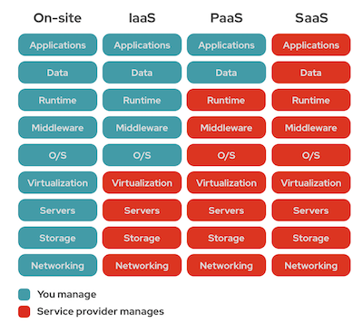

## CLOUD SERVICE MODELS

       
[Reference](https://www.redhat.com/en/topics/cloud-computing/iaas-vs-paas-vs-saas)

### **Infrastructure-as-a-Service (IAAS)**  
Infrastructure As A Service (IAAS) is means of delivering computing infrastructure as on-demand services. It is one of the three fundamental cloud service models. The user purchases servers, software data center space, or network equipment and rent those resources through a fully outsourced, on-demand service model. It allows dynamic scaling and the resources are distributed as a service. It generally includes multiple-user on a single piece of hardware. IaaS products allow organizations to manage their business resources — such as their network, servers, and data storage — on the cloud.  
Examples of IAAS products:  
* Amazon Web Services
* Google Cloud
* Microsoft Azure
* Digital Ocean
* Linode

#### When are IAAS products used?  
They are used when an increase in scale and performance is required. They are also used for enhanced security, and reduction in the costs of running an application or workload.  
They are used for quick set-up of test and development environments. IaaS makes it quick and economical to scale dev/test environments up and down.  

#### Advantages of IAAS  
* Pay for What You Use: Fees are computed via usage-based metrics
* Reduce Capital Expenditures: IaaS is typically a monthly operational expense
* Dynamically Scale: Rapidly add capacity in peak times and scale down as needed
* Increase Security: IaaS providers invest heavily in security technology and expertise

#### Disadvantages of IAAS  
* Unexpected Costs: Monthly fees can add up, or peak usage may be more than expected
* Process Changes: IaaS may require changes to processes and workflows
* Runaway Inventory: Instances may be deployed, but not taken down
* Security Risks: While IaaS providers secure the infrastructure, businesses are responsible for anything they host

 
 

### **Platform-as-a-Service (PAAS)**
Platform as a service (PaaS) is a cloud infrastructure layer that provides resources to build user-level tools and applications. It includes the underlying infrastructure including compute, network, and storage resources, as well as development tools, database management systems, and middleware. PaaS products allow businesses and developers to host, build, and deploy consumer-facing apps.  
Example of PAAS products: 
* AWS Elastic Beanstalk 
* Google App Engine
* Red Hat OpenShift
* Microsoft Azure
* Heroku

When are PAAS products used?  
PaaS products are used when flexibility, increased security, cost and time are very important. 

Platform as a service (PaaS) is essentially a layer between infrastructure as a service (IaaS) and software as a service (SaaS). While IaaS provides just the pay-as-you-go infrastructure for a company, PaaS steps it up by also providing a variety of tools needed to create applications.

#### Advantages of PAAS 
* Cost Effective: No need to purchase hardware or pay expenses during downtime
* Time Savings: No need to spend time setting up/maintaining the core stack
* Speed to Market: Speed up the creation of apps
* Future-Proof: Access to state-of-the-art data center, hardware and operating systems

#### Disadvantages of PAAS 
* Vendor Dependency: Very dependent upon the vendor’s capabilities
* Risk of Lock-In: Customers may get locked into a language, interface or program they no longer need
* Compatibility: Difficulties may arise if PaaS is used in conjunction with existing development platforms
* Security Risks: While PaaS providers secure the infrastructure and platform, businesses are responsible for security of the applications they build.
 
 
### **Software-as-a-Service (SAAS)**
Software As A Service (SAAS) allows users to run existing online applications and it is a model software that is deployed as a hosting service and is accessed over Output Rephrased/Re-written Text the internet or software delivery model during which software and its associated data are hosted centrally and accessed using their client, usually an online browser over the web. SAAS services are used for the development and deployment of modern applications. SaaS products offer both consumers and businesses cloud-based tools and applications for everyday use.  
Example of PAAS products:  
* HubSpot
* JIRA
* Dropbox
* DocuSign
* Trello

When are SAAS products used?  
SAAS products are used to reduce the need of installing and maintaining software. It can be simply accessed via the Internet, removing the task of management of hardware and complex software. 

#### Advantages of SAAS 
* Reduced time to benefit: Software as a service (SaaS) differs from the traditional model because the software (application) is already installed and configured. You can simply provision the server for an instance in cloud, and in a couple hours, you'll have the application ready for use. This reduces the time spent on installation and configuration and can reduce the issues that get in the way of the software deployment.  
* Lower costs: SaaS can provide beneficial cost savings since it usually resides in a shared or multi-tenant environment, where the hardware and software license costs are low compared with the traditional model.  
* Scalability and integration: You have the flexibility to be able to scale your SaaS use up and down based on specific needs.  
* New releases (upgrades): With SaaS, the provider upgrades the solution and it becomes available for their customers. The costs and effort associated with upgrades and new releases are lower than the traditional model.

#### Disadvantages of SAAS 
* Insufficient Data Security: This is one of the top concerns for companies that make use of the SaaS-based application model. Issues such as identity and access management as well as how much sensitive company information need to be supplied are important factors to consider when using a SAAS product.
* Difficulty with Regulations Compliance
* Low Performance of Software
* Troublesome Software Integration: When working with an external SaaS service provider to host multiple apps, there might be an integration problem with the existing in-house software.