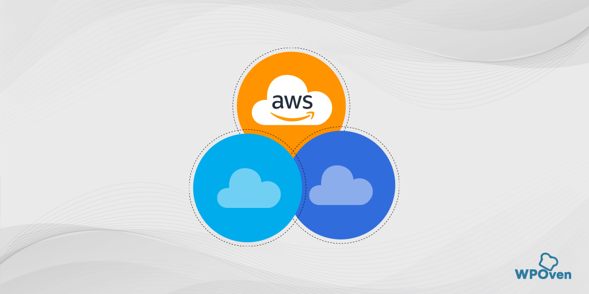
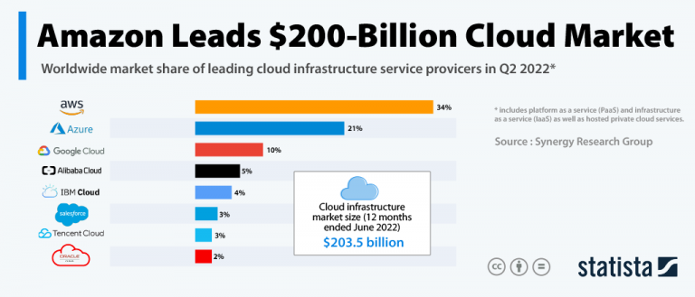
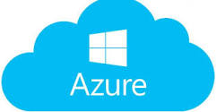
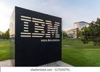

Cloud computing has become an immensely growing market and offers incredible opportunities for companies who want to establish themselves to become a leader in the cloud computing market.

# **AWS**

AWS (Amazon Web Services) is one of the leading companies that are dominates the cloud market by almost 34%.

AWS is a subsidiary of Amazon, that provides cloud services with its own infrastructure and solutions. It is not a subdivision of any parent company like Microsoft’s Azure. 

The resources of AWS are interconnected with dedicated data centers that are located all globally, with the help of which, amazon delivers a fast, smooth, less latency, and better user experience to their customers.

AWS business system is a comprehensive and evolving one that includes a mixture of infrastructure-as-a-service (IaaS), platform-as-a-service (PaaS) and packaged-software-as-a-service (SaaS) offerings.

Some popular leading companies and brands such as Netflix, Facebook, LinkedIn, and Baidu use AWS for hosting their website on AWS and it has become their first choice.

From the above image from statists, you can clearly see, AWS market share is about 34% among the world’s leading cloud infrastructure service providers. Amazon has become the biggest chunk of the remaining top contenders such as Google and Microsoft’s Azure.

Over the past ten years, it has been observed that AWS has shown some incredible exponential growth due to this AWS market share has increased. In just seven years it has increased more than ten times.

# **AWS SERVICES**

## **Computing**
Provides Secure & Resizable Compute Capacity with Easy Scalability. These include
**Amazon Elastic Compute Cloud (EC2)**
* One of the most popular and mostly used compute services that AWS provides for doing computations and processing. 
* EC2 allows you to deploy virtual servers within your AWS environment.
* EC2 service can be broken down into following components;
Amazon Machine Images (AMI), instance types, instance purchasing options, user data, storage, security.

**Amazon Elastic Container Service (ECS)**
* ECS allows you to run container based application across a cluster of EC2 instances without requiring you to manage a complex and administratively heavy cluster management system. 
* You can deploy, manage and scale containerized applications by using ECS.
* You don't have to install softwares for managing and monitoring these clusters. 

**Amazon Elastic Container Registry (ECR)**
* ECR links closely to ECS. 
* It provides secure location to store and manage your docker images that can be deployed across your applications

**Amazon Elastic Kubernetes Service (EKS)**
 * EKS allows you to run and manage your infrastructure in kubernetes environment.
 * Kubernetes is an open-source tool to manage or orchestrate your containers in form of worker nodes designed to automate, deploying, scaling, and operating containerized applications. 
 * It is designed to grow from tens, thousands, or even millions of containers. 

AWS Lambda
Amazon Lightsail
AWS Batch
**Amazon Elastic Beanstalk**
* AWS Elastic Beanstalk is a fully managed AWS service that allows you to upload the code of your web application and automatically deploys and provision the required resources required to make your application functional. 
* It is an AWS managed service but it also provides options for managing resources such as EC2 instances, auto-scaling groups, load-balancers, software support, databases etc for providing you to take complete control of it. 
* Elastic BeanStalk is brilliant service if you just want to upload your code and show it as a prototype of any software.
* For every application you need to create environment for it, which is responsible to manage those resources in form of Cloudformation stack.

**Amazon Lambda**
* Amazon Lambda is a serverless compute service which has been designed to allow you to run your code (function) without having to manage and provision the EC2 servers. 
* Serverless means that you do not have to manage your compute resources by yourself instead AWS will do the heavy work for your application.

**Amazon Lightsail** 
* A compute service that resembles with EC2 service. Essentially a virtual private server VPS backed by AWS infrastructure much like as EC2 but with less configuration options. 
* Amazon Lightsail is designed for small scale business or for single users. With its simplicity and small-scale use, it's commonly used to host simple websites, small applications, and blogs.

## **Storage**
AWS provides you with multiple storage options right from legacy backup to modern high throughput, distributed file systems. AWS gives you a variety of storage options such as; 

**Amazon S3**
* Amazon S3 is an object storage service that stores data of any type and size. 
* It can store data for any business such as web applications, mobile applications, backup, archive, analytics. 
* S3 also allows a simple web-based file explorer to upload files, create folders or delete them.

**Amazon Block Storage (EFS)**
* EBS provides block storage which is similar to hard drives to store any kind of data persistently. * This can be attached to any EC2 instance and used as block storage, which even allows you to install any operating system. 
* EBS volumes are placed in availability zones so that they are replicated to prevent loss of data due to single component failures. EBS is available in both SSD and HDD formats depending on your requirement of speed and volume.

**Elastic File System (EFS)**
* EFS is a managed network file system that is easy to set up right from the amazon console or CLI.  
* Unlike EBS, EFS is built using the NFS4.x protocol on SSDs and have a much faster throughput. This also means that EFS is much more expensive than EBS as it can be used on very large analytical workloads. 
* EFS scales up or down based on the size of the files you store and is also accessible from multiple availability zones.

**Amazon FSx for Lustre**
Luster is a file system used for compute-intensive workloads.

It Mainly comes into the picture when you need to run machine learning operations on large data sets or when you need to run media encoding workloads. Running Lustre separately requires a lot of expertise in setting it up and configuring it for the right workloads. With the help of Amazon FSx, this can be avoided and a simple interface on the console helps you to quickly get started and start working on your data.

**Amazon S3 Glacier**
The glacier is used mainly for archival and long-term data storage. This means that there is a low retrieval rate on this storage system, this is why it is offered at an extremely cheap rate. It does also come with compliant security features to encrypt your data. Glacier allows you to run queries and analytics on it directly and you will be charged only for the few minutes or hours when you read the data. Glacier hopes to replace the legacy on-premise tape-based backup service with a much more cost-effective and durable solution.

AWS storage also include Amazon FSx for Windows File Server
and AWS Storage Gateway, a simple way to let on-premise applications store.

## **Database**
**Amazon Aurora**
* Designed for unparalleled high performance and availability
at global scale with full MySQL and PostgreSQL compatibility.

**Amazon DynamoDB** 
* A key-value and document database that delivers single-digit millisecond performance at any scale. 
* It's a fully managed, multiregion, multimaster database with built-in security, backup and restore, and in-memory caching for internet-scale applications. 

**Amazon ElastiCache**
* Amazon ElastiCache is a web service that makes it easy to deploy, operate, and scale an in-memory cache in the cloud.

**Amazon Keyspaces (for Apache Cassandra)**
* Amazon Keyspaces (for Apache Cassandra) is a scalable, highly available, and managed Apache Cassandra–compatible database service. 
* With Amazon Keyspaces, you can run your Cassandra workloads on AWS using the same Cassandra application code and developer tools that you use today. 

**Amazon MemoryDB For Redis**
* This is a Redis-compatible, durable, in-memory database service that delivers ultra-fast performance. It is purpose-built for modern applications with microservices architectures.

**Amazon Neptune**
* A fast, reliable, fully-managed graph database service that makes it easy to build and run applications that work with highly connected datasets. 
* The core of Amazon Neptune is a purpose-built high-performance graph database engine optimized for storing billions of relationships and querying the graph with milliseconds latency.

**Amazon Relational Database Service (Amazon RDS)**
* RDS makes it easy to set up, operate, and scale a relational database in the cloud. 
* It provides cost-efficient and resizable capacity while automating time-consuming administration tasks such as hardware provisioning, database setup, patching and backups. 

**Amazon Relational Database Service (Amazon RDS) on VMware** lets you deploy managed databases in on-premises VMware environments using the Amazon RDS technology enjoyed by hundreds of thousands of AWS customers.

**Amazon Quantum Ledger Database (Amazon QLDB)**
* Amazon QLDB is a fully managed ledger database that provides a transparent, immutable, and cryptographically verifiable transaction log owned by a central trusted authority. 
* Amazon QLDB tracks each and every application data change and maintains a complete and verifiable history of changes over time.

**Amazon Timestream**
* A fast, scalable, fully managed time series database service for IoT and operational applications that makes it easy to store and analyze trillions of events per day at 1/10th the cost of relational databases. 

**Amazon DocumentDB (with MongoDB compatibility)**
*  A fast, scalable, highly available, and fully managed document database service that supports MongoDB workloads.

**Amazon Lightsail** managed databases are separate from compute workloads, so you can build applications and websites on Lightsail instances without interruption.

 

## **Networking and Content Delivery**
**Amazon API Gateway**
* A fully managed service that makes it easy for developers to create, publish, maintain, monitor, and secure APIs at any scale.

**Amazon CloudFront**
* A fast content delivery network (CDN) service that securely delivers data, videos, applications, and APIs to customers globally with low latency, high transfer speeds, all within a developer-friendly environment.
* Amazon VPC, AWS Direct Connect, Amazon Route S3.

**Amazon Route 53**
* A highly available and scalable cloud Domain Name System (DNS) web service. It is designed to give developers and businesses an extremely reliable and cost-effective way to route end users to Internet applications by translating human-readable names, such as www.example.com, into the numeric IP addresses, such as 192.0.2.1, that computers use to connect to each other. 
* Amazon Route 53 is fully compliant with IPv6 as well.

**Amazon Virtual Private Cloud (Amazon VPC)**
* It lets you provision a logically isolated section of the AWS Cloud where you can launch AWS resources in a virtual network that you define.

**AWS App Mesh**
* AWS App Mesh makes it easy to monitor and control microservices running on AWS. 

**AWS Cloud Map**
* A cloud resource discovery service. 
* With AWS Cloud Map, you can define custom names for your application resources, and it maintains the updated location of these dynamically changing resources.

**AWS Direct Connect** makes it easy to establish a dedicated network connection from your premises to AWS.

**AWS Global Accelerator** is a networking service that improves the availability and performance of the applications that you offer to your global users.

**AWS PrivateLink**
* It simplifies the security of data shared with cloud-based applications by eliminating the exposure of data to the public Internet.

**AWS Private 5G** offers an easy way to use cellular technology to augment your current network.

**AWS Transit Gateway**
* A service that enables customers to connect their Amazon Virtual Private Clouds (VPCs) and their on-premises networks to a single gateway.

**AWS Virtual Private Network (AWS VPN)** solutions establish secure connections between your on-premises networks, remote offices, client devices, and the AWS global network.

**Elastic Load Balancing (ELB)** automatically distributes incoming application traffic across multiple targets, such as Amazon EC2 instances, containers, and IP addresses.

## **Management Tools**
**Amazon CloudWatch** 
* A monitoring and management service built for developers, system operators,
site reliability engineers (SRE), and IT managers.
* CloudWatch provides you with data and actionable
insights to monitor your applications, understand and respond to system-wide performance changes, optimize resource utilization, and get a unified view of operational health.

**AWS Auto Scaling** monitors your applications and automatically adjusts capacity to maintain steady,
predictable performance at the lowest possible cost. Using AWS Auto Scaling, it’s easy to setup
application scaling for multiple resources across multiple services in minutes.

**AWS CloudFormation** gives developers and systems administrators an easy way to create and manage
a collection of related AWS resources, provisioning and updating them in an orderly and predictable
fashion.

**AWS Compute Optimizer** recommends optimal AWS resources for your workloads to reduce costs
and improve performance by using machine learning to analyze historical utilization metrics.

**AWS Chatbot** is an interactive agent that makes it easy to monitor and interact with your AWS resources in your Slack channels and Amazon Chime chat rooms. With AWS Chatbot you can receive alerts, run commands to return diagnostic information, invoke AWS Lambda functions, and create AWS support
cases.

**AWS Control Tower** automates the set-up of a baseline environment, or landing zone, that is a secure, well-architected multi-account AWS environment.

**AWS CloudTrail** is a web service that records AWS API calls for your account and delivers log files to
you.

**AWS Config** is a fully managed service that provides you with an AWS resource inventory, configuration history, and configuration change notifications to enable security and governance.

**AWS OpsWorks** is a configuration management service that provides managed instances of Chef
and Puppet.

**AWS Trusted Advisor.** is an online resource to help you reduce cost, increase performance, and improve security by optimizing your AWS environment.

**AWS Proton** is the first fully managed delivery service for container and serverless applications. Platform engineering teams can use AWS Proton to connect and coordinate all the different tools needed for infrastructure provisioning, code deployments, monitoring, and updates.

Other Management services offered by AWS include AWS Service Catalog, AWS Organizations, AWS Systems Manager, AWS Managed Services, AWS Console Mobile Application, AWS License Manager,
AWS Well-Architected Tool.

## **Security, Identity, and Compliance**
These Include Amazon Cognito, Amazon Detective, Amazon GuardDuty, Amazon Inspector, Amazon Macie, AWS Artifact, AWS Audit Manager, AWS Certificate Manager, AWS CloudHSM, AWS Directory Service, AWS Firewall Manager, AWS Identity and Access Management, AWS Key Management Service, AWS Network Firewall, AWS Resource Access Manager, AWS Secrets Manager, AWS Security Hub

## **Analytics**
Amazon Athena, Amazon CloudSearch, Amazon EMR, 
Amazon FinSpace, Amazon Kinesis, Amazon Kinesis Data Firehose, Amazon Kinesis Data Analytics, Amazon Kinesis Data Streams, Amazon Kinesis Video Streams, Amazon OpenSearch Service, Amazon Redshift, Amazon QuickSight, AWS Data Exchange, AWS Data Pipeline, AWS Glue, AWS Lake Formation, Amazon Managed Streaming for Apache Kafka (Amazon MSK). 

## **Application Integration**
AWS Step Functions, Amazon AppFlow, Amazon EventBridge, Amazon Managed Workflows for Apache Airflow (MWAA), Amazon MQ, Amazon Simple Notification Service, Amazon Simple Queue Service, Amazon Simple Workflow Service.

## **Developer Tools**
Amazon Corretto, AWS Cloud9, AWS CloudShell, AWS CodeArtifact, AWS CodeBuild, AWS CodeCommit, AWS CodeDeploy, AWS CodePipeline, AWS CodeStar, AWS Fault Injection Simulator, AWS X-Ray.

## **Game Tech**
Amazon GameLift, Amazon Lumberyard

## **Business Applications**
Alexa for Business, Amazon Chime, Amazon SES, Amazon WorkDocs, Amazon WorkMail, Amazon Honeycode, Amazon Chime SDK, Amazon Pinpoint

## **Internet of Things (IoT)**
AWS IoT 1-Click, AWS IoT Analytics, AWS IoT Button, AWS IoT Core, AWS IoT Device Defender, AWS IoT Device Management, AWS IoT Events, AWS IoT Greengrass, AWS IoT SiteWise, AWS IoT Things Graph, AWS Partner Device Catalog, FreeRTOS.

## **Machine Learning**
Amazon Augmented AI, Amazon CodeGuru, Amazon Comprehend, Amazon DevOps Guru, Amazon Forecast, Amazon Fraud Detector, Amazon HealthLake, Amazon Comprehend Medical, Amazon Kendra, Amazon Lex, Amazon Lookout for Equipment, Amazon Lookout for Metrics, Amazon Lookout for Vision, Amazon Monitron, AWS Panorama, Amazon Personalize, Amazon Polly, Amazon Rekognition, Amazon SageMaker, Amazon Textract, Amazon Transcribe, Amazon Translate, AWS DeepComposer, AWS DeepLens, AWS DeepRacer

## **Migration and Transfer**
For effective Migration and transfer, AWS offers the following services;
AWS Application Migration Service,
AWS Migration Hub, AWS Application Discovery Service, AWS Database Migration Service, AWS Server Migration Service, AWS Snow Family, AWS DataSync and AWS Transfer Family.

Other services offered by AWS include Containers, Robotics, Satellite, Media Services, AR and VR, Front-End Web and Mobile Services and Blockchain services.

# **Microsoft Azure Services**
Microsoft Azure is a growing collection of integrated cloud services which developers and IT professionals use to build, deploy and manage applications through their global network of datacentres. 

Microsoft sorts Azure cloud services into nearly two dozen categories. Each category can include numerous specific instance or service types. The most popular service categories include the following:

## **Compute**
Compute service provides the building leevel products, which dictates and determines the execution of an application in Azure Platform. Example of Azure compute services include;

### **Virtual Machine:**
* Allows you to deploy any workload, language and any operating system virtually.

### **Virtual Machine Scale Sets**
* Allows you to create thousands of virtual machines within minutes.
* Rely on integrated balancing

### **Azure Container Service**
* Create a container holding a solution
* Scale and orchestrate applications using DC/OS, Docker, Swarm or Kube.

### **Azure Container Registry**
* Store and manage container images across all types of Azure deployments.

### **Functions**
* Lets you write code regardless of infrastructure and provisioning of servers, especially when your Functions call rates scales up.

### **Batch**
* scales to tens, hundreds or thousands of virtual machines.
* Stage data and execute compute pipelines.

### **Service Fabric**
* Simply micro service–based application development and lifecycle management. 
* Deliver low–latency performance and efficiency at massive scale.

### **Cloud Services**
* Focus on apps, not hardware.
* Support Java, Node.js, PHP, Python, .NET and Ruby.

## **Storage**
* It is the cloud storage solution for modern applications that rely on durability, availability, and scalability to meet the needs of their customers.
* Massively scalable so you can store and process hundreds of terabytes of data to support the big data scenarios required by scientific analysis, financial analysis and media applications.
* Elastic, so you can design applications for a large global audience and scale those applications as needed.
* Has an auto–partitioning system that automatically load–balances your data based on traffic.

**Blob Storage**
* Azure Blob storage is a service that stores unstructured data in the cloud as objects/blobs.
* It can store any type of text or binary data such as a document, media file, or application installer.

**Queue Storage**
* Azure Queue storage provides cloud messaging between application components.
* Queue storage delivers asynchronous messaging for communication between application components.

**File Storage**
* Offers file shares in the cloud using the standard Server Message Block (SNB) protocol.
* With Azure file storage, you can migrate legacy applications that rely on file shares to Azure quickly and without costly rewrites.

**Table Storage**
* Azure Table storage is a service that stores semi–structured NoSQL data in the cloud, providing a key/attribute store with a schemaless design.

## **Web + Mobile Services**
**Web Apps**
* Azure Web Apps enable you to build and host websites in the language of your choice without managing infrastructure.

**Mobile Apps**
* Mobile Apps in Azure App Service offer a highly scalable, globally available mobile application development platform for Enterprise Developers and System Integrators.

**API Apps**
* API Apps in Azure service offer features that make it easier to develop, host and consume APIs in the cloud and on–premises.

**Logic Apps**
* Logic Apps provide a way to simplify and implement scalable integrations and workflows in the cloud.
* It provides a visual designer to model and automate the process as a series of steps known as workflow.

**Notification Hubs**
* Azure Notification Hubs provide an easy–to–use, multi–platform, scaled–out, push engine.

**Event Hubs**
* Azure Event Hubs is a highly scalable data streaming platform capable of ingesting millions of events per second.
* Data sent to an event hub can be transformed and stored using any real–time analytics provider or batching/storage adapters.

**Azure Search**
* Azure Search is a cloud search–as–a–service solution that delegates server and infrastructure management to Microsoft.
* It leaves you with a ready–to–use service that you can populate with your data and then use to add such to your web or mobile application.

## **Database Services**
**SQL Database**
* SQL Database is a relational database service in the Microsoft cloud based on the market–leading Microsoft SQL Server engine.

**DocumentDB**
* DocumentDB is a fully managed NoSQL database service built for fast and predictable performance, high availability, elastic scaling, global distribution, and ease of development.

**Redis Cache**
* Managed by Microsoft, it is a secure and dedicated Redis Cache which is an advanced key–value store, where keys can contain data structures such as strings, hashes, lists, sets, and sorted sets.

## **Networking and Content Delivery**
* Impart scalability and security to enterprise apps using Azure Networking Solutions.
* Connect privately and securely to cloud with Azure ExpressRoute.
* Distribute user traffic to specific endpoints with Azure Traffic Manager.
* Obtain unmatched availability and performance with Azure Load Balancer.
* Tie on–premises infrastructure to the cloud with VPN Gateway.

**Virtual Network**
* Perform Network isolation and segmentation.
* Filter and route network traffic.

**Load Balance**
* Delivers high availability and network performance to your applications.
* Load balance incoming internet traffic to virtual machines.
* Forward external traffic to a specific virtual machine.

**Application Gateway**
* A dedicated virtual appliance providing Application Delivery Container (ADC) as a service.
* Comprised of multiple worker instances for scalability and high availability.

**Azure DNS**
* DNS is responsible for translating a website or service name to its IP address.
* Azure DNS is a hosting service for DNS domains, providing name resolution using Mircrosoft infrastructure.

**VPN Gateway**
* A type of virtual Network Gateway that sends encrypted traffic across a public connection.
* Use VPN gateways to send traffic between Azure virtual networks over the Microsoft network.

**Traffic Manager**
* Allows you to control the distribution of user traffic for service endpoints such as Azure VMs, Web Apps and Cloud Services in different Data centers.

**Express Routes**
* Lets you extend your on–premises Networks into the Microsoft cloud over a dedicated private connection facilitated by a connectivity provider.
* Establish connections to Microsoft cloud services such as Microsoft Azure, Office 365 and CRM online.

## Security and Identity Compliance Services
**Key Vault**
* Azure Key Vault helps safeguard cryptographic keys and secrets used by cloud applications and services and streamlines the key management process.

**Azure Active Directory**
* It is Microsoft multi–tenant cloud based directory and identity management service including multi–factor authentication, device registration, etc

**Azure AD B2C**
* Azure AD B2C is a comprehensive cloud identity management solution for your consumer–facing web and mobile applications.
* It is a highly available global service that scales to hundreds of millions of consumer identities.

**Azure AD Domain Services**
* Azure AD Domain Services provides managed domain services such as domain join, group policy, LDAP, Kerberos/NTLM authentication that are fully compatible with Windows Server Active Directory.

**Multi–Factor Authentication**
* Azure Multi–Factor authentication (MFA) is Microsoft two–step verification solution which helps safeguard access to data and applications while meeting user demand for a simple sign–in process.

## **Monitoring + Management Services**
**Microsoft Azure Portal**
* Build, manage, and monitor everything from simple web apps to complex cloud applications in a single unified console.

**Azure Resource Manager**
* It enables you to repeatedly deploy your app and have confidence your resources are deployed in a consistent state.
* It makes it easy for you to manage and visualize resources in your app.
* With Azure Resource Manager, you can control who in your organization can perform actions on the resources.

**Automation**
* Microsoft Azure Automation provides a way to automate the manual, long–running, erro–prone, and frequently repeated tasks that are commonly performed in a cloud and enterprise environment.
* You can automate processes using runbooks or automate configuration management using Desired State Configuration.

## **Azure Outages**
**Significant outages**

* Microsoft Azure has a history of major outages dating back to early 2012. Following are some of the more significant outages that have occurred over the years:

* February 29, 2012. A disruption occurred as a result of the leap day bug.

* July 26, 2012. The West Europe region experienced an interruption that lasted for about two and a half hours.

* February 22, 2013. A major outage prevented customers across all regions from being able to access Windows Azure Storage Blobs, tables and queues using HTTPS.

* October 30, 2013. Users across the United States, Europe and Asia experienced an outage lasting for about eight hours. This outage was attributed to an issue with swapping virtual IP addresses.

* November 18, 2014. An outage lasting for nearly 10 hours caused storage connectivity issues.

* December 3, 2015. Many customers in Europe were unable to access Office 365 for approximately four hours.

* September 15, 2016. A DNS issue caused problems for Azure users around the world for several hours.

* March 15, 2017. An issue in one of Microsoft's data centers spread around the world and ultimately affected 26 of Microsoft's 28 datacenters, resulting in a worldwide outage that lasted for about 7 hours.

* September 29, 2017. A seven-hour outage occurred in northern Europe due to the accidental discharge of a fire suppression system.

* June 20, 2018. Customers in northern Europe experienced an outage lasting nearly 11 hours following a temperature issue at one of the data centers.

* September 4, 2018. Lightning strikes caused a voltage increase in a south-central United States data center, resulting in issues with the cooling system. Customers across 10 regions were ultimately affected because of service dependencies.

* May 2, 2019. A DNS outage caused several Azure services to become unavailable for nearly three hours.

* March 15, 2021. An Azure Active Directory outage caused a 14-hour outage in multiple Microsoft services including Azure, Office, Teams, Dynamics 365, Xbox Live and more. A smaller DNS outage followed on April 1, 2021.

* October 13, 2021. Azure VM services and some other Azure services became unavailable for about eight hours.

Microsoft maintains a complete index of all outages/issues for the last five years. Users can research specific outages, detailed implications, underlying causes and fixes at Microsoft's Azure status history page.

# **Google Cloud Service Domains**

Google Cloud Platform is a set of cloud computing services that Google offers, which runs on the same infrastructure that Google uses for its end-user products, such as YouTube, Gmail, and more. Google Cloud Platform offers a variety of services, including: 
Compute, Network, Machine learning and AI, Big data processing.

## **Compute**
The compute service enables compute and hosting on the cloud. The various services under this are as follows:
* App Engine  
* Compute Engine  
* Kubernetes Engine 
* Cloud Functions  
* Cloud Run

## **Storage and Database**
The storage and database service enables the application to store media files, backups, or other file-like objects. The services include:

* Cloud Storage
* Cloud SQL 
* Cloud Bigtable 
* Cloud Spanner 
* Cloud Datastore

## **Networking**
The networking service enables us to load-balance traffic across resources, create DNS records, and much more. Some of the services include:
* VPC 
* Cloud Load Balancing 
* Cloud Armor 
* Cloud CDN 
* Cloud Interconnect 
* Cloud DNS 
* Network Service Tiers

## **Developer Tools**
The developer tools service includes tools that enable software and application development. 
Artifact Registry (beta) 
* Cloud SDK 
* Cloud Code 
* CloudBuild
* Cloud Scheduler
* Cloud Tasks 

## **Identity and Security**
This service deals with security and authentication:
* Cloud Identity 
* Cloud IAM 
* Cloud Data Loss Prevention API
* Security Key Enforcement

## **Internet of Things**
You can leverage GCP to create IoT environments with the following tools:
* Cloud IoT Core 
* Edge TPU 
* Cloud IoT

## **Cloud AI**
Cloud AI comprises services related to machine learning, which also encompasses:
* Cloud AutoML 
* Cloud Natural Language 
* Cloud Speech-to-Text 
* Cloud Text-to-Speech 
* Cloud Translation API
* Cloud Vision API 
* Cloud Video Intelligence

## Management Tools
This domain includes services related to management and monitoring. The services under this are as follows:
* Cloud Deployment Manager  
* Cloud Console 
* Cloud Shell
* Cloud APIs

## **Big Data**
The big data service enables us to process and query big data in the cloud.  A few of the included services are the following:
* BigQuery 
* Cloud Dataproc
* Cloud Datalab 
* Cloud Data Studio 
 

 

# **IBM Cloud** 

IBM (International Business Machines Corporation), the global computing company that established one of the first PC computers, made history once again in the age of cloud computing by acquiring SoftLayer cloud in 2013. SoftLayer, which was founded in 2005, offered bare-metal compute service before any other large provider companies at the time.

IBM cloud services are a full-stack consisting of a huge collection of more than 170 products and cloud computing services for business-to-business (B2B) organizations, which are deployed around the world. As is the case with many other universal cloud computing services – such as Amazon Web Services (AWS), Microsoft Azure, and Google Cloud mentioned above – IBM Cloud includes the three main service models (or types) of cloud computing. These include: infrastructure as a service (IaaS), platform as a service (PaaS), and, recently, software as a service (SaaS), with a special focus on (IaaS). It is also offered through the deployment models of public, private, and hybrid cloud.

## **IBM Cloud Services**
The following list is merely an attempt to confine the most common and important IBM Cloud Services in addition to some third-party vendors’ support services.

## **Cloud Computing**
IBM computing and services are distributed – but not limited to – three main fields of high computing solutions, including:
* Bare metal servers, virtual cloud servers, dedicated mass storage servers, and SAP Certified infrastructure.
* VMware solutions to enable migrating from on-premise.
* Container registry with Docker container, Kubernetes service, and Serverless platform Functions.

## **Cloud Networking**
IBM Cloud Networking gives you a high-performance bouquet of services, which include:
* Public, private, hybrid networks.
* Load balancers, firewalls, and VPN tunnels.
* Content delivery network (CDN).
* Secure encrypted data network.
* Integrating cloud and on-premises systems by App   
Connect and IBM Secure Gateway.

## **Cloud Storage**
IBM cloud storage is not only for files; it provides scalable, highly secure, and low-cost options, including database and storage of Big Data, to make it easier to deploy services such as:

* Access objects storage solutions for SQL and NoSQL.
* Block storage, and NFS-based file-share solution up to 12 TB.
* File storage NFS-based file-share solution that scalable and backed by flash.
* Document store Cloudant to process heavy loads concurrent for NoSQL JSON.

## **Cloud Analytics and Developer Tools**
* IBM Cloud provides core Analytics services and solutions that enable you to analyze, track events, and monitor all of your analyzing needs, from security to products.
* The IBM Bluemix cloud also contains an analytics engine mixed with Apache Spark & Hadoop services, especially suitable for hybrid cloud options.

For developers, some consider IBM Cloud a paradise in terms of workspaces. Programmers are known to have an efficient deployment of code in less time than normal. Carrying out Continuous Integration, deployment, and delivery processes is easier, thanks to the ability to make analytics and analysis on streaming data.

## **Artificial Intelligence (AI), Machine Learning, IoT, and Mobile**
IBM’s AI Watson is well known as one of the most amazing machine learning APIs ever created; it provides many AI-based innovations. in addition to running IoT backends, this technology includes the following:
* Virtual assistants.
* Text to speech.
* Visual recognition.
* Natural language processing.
* Deep learning.
* Manage analytics on the data ingested from IoT devices.
* IBM Weather API 5.
* Building mobile applications and their back-end components.
* Providing IBM’s Blockchain Platform to develop Blockchain apps.
## **Management and Security**
IBM Cloud Includes (and provides) many tools and services for active management and tracking of all resources for management, administrative, security, and financial aspects. This is achieved using log analysis, automation, Infrastructure as Code (IaC), identity and access management, and advanced authentication solutions.

The cloud providers that we've talked about above are the top 4 players in the cloud service providers in the Cloud Computing industry.
Other cloud computing providers include 
* Oracle Cloud
* Alibaba Cloud
* RedHat
* Heroku
* Digital Ocean
* CloudFlare
* Linode
* Cloudways
* Rackspace
* Terremark
* Joyent

Currently, there is a lack of standardization among cloud services and capabilities. Most cloud providers offer a broad suite of similar services, but no two cloud providers offer the same service in the exact same way. Cloud providers rely on APIs and other integrations to handle provisioning and services in a programmatic manner. Because each provider uses unique APIs, the onus is on users to accommodate differences between cloud providers. Thus, to migrate a workload from one cloud to another might require significant recoding of the application or rearchitecting of the cloud environment to support the workload. This makes it difficult for a business to use more than one public cloud provider when pursuing a multi-cloud strategy. Third-party cloud management tools can reduce some of these challenges.
