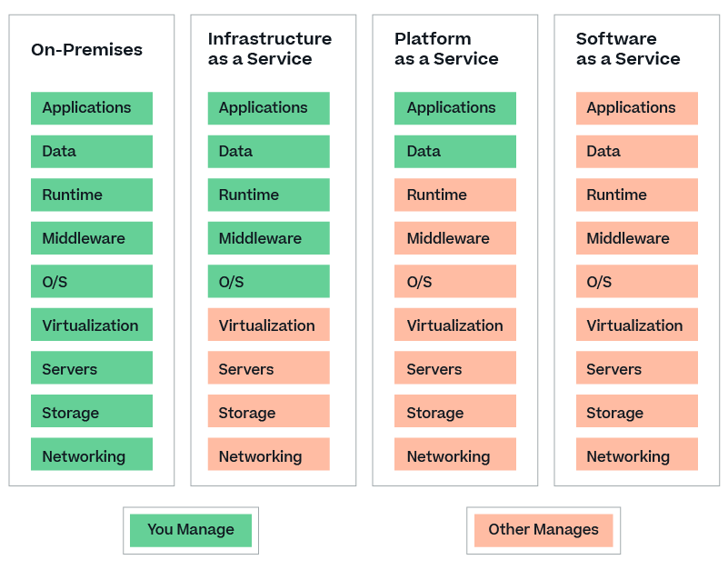

# Computing Services

**Computing Services** entails all information technology and computer systems (including Software, application service provider services, hosted computing services, information technology, telecommunication hardware, etc) relating to the transmission, storage, maintenance, organization, presentation, generation, processing or analysis of data and information whether or not in electronic format.  

Computing Services can be categorized into three primary models as follows:

- Infrastructure as a Service (IaaS)
- Platform as a Service (PaaS)
- Software as a Service (SaaS)

## Infrastructure as a Service (IaaS)

**IaaS** is a business model that delivers IT infrastructure like compute, storage, and network resources on a pay-as-you-go basis over the internet. You can use IaaS to request and configure the resources you require to run your applications and IT systems. You are responsible for deploying, maintaining, and supporting your applications, and the IaaS provider is responsible for maintaining the physical infrastructure. IaaS gives you flexibility and control over your IT resources in a cost-effective manner.  

Some IaaS cloud services includes:  

- Amazon Simple Storage Service (S3)
- Amazon Elastic Compute Cloud (Amazon EC2)
- Amazon Elastic Block Store (Amazon EBS)
- Amazon Elastic File System (Amazon EFS)
- Azure Disc Storage
- Azure File Storage
- Azure Blob Storage
- Azure Queue Storage
- Google Compute Engine
- Google Cloud Storage
- Google Cloud Filestore
- Google Persistent Disk

## Platform as a Service (PaaS)

**PaaS** provides hardware and software infrastructure that you can use to develop and maintain applications. The cloud provider hosts the hardware and the software development tools in its data center. You can build, test, run, and scale applications faster and at a lower cost by using PaaS than on your on-premises infrastructure.  

Some PaaS cloud services includes:

- AWS CodePipeline
- AWS CodeDeploy
- AWS Elastic Beanstalk
- Azure App Service
  - Azure Web Apps
  - Azure Web Apps for Containers
  - Azure API Apps
- Google App Engine

## Software as a Service (SaaS)

**SaaS** is a business and software delivery model that enables organizations to offer their solution in a low-friction, service-centric approach. SaaS provides the entire software application over the internet. You can use it to perform different tasks. In SaaS, the cloud provider hosts the hardware, the software tools, and the application itself in its data center.  

Some SaaS services includes:

- Google G-Suites
- Microsoft Office 365
- Dropbox
- GitHub
- Zoom

## IaaS vs PaaS vs SaaS Summary

### References

- [*IaaS (Infrastructure as a Service):
The Ultimate Guide*](https://cloud.netapp.com/iaas)  
  
- [*What is Infrastructure as a Service (IaaS)?*](https://aws.amazon.com/what-is/iaas/)
