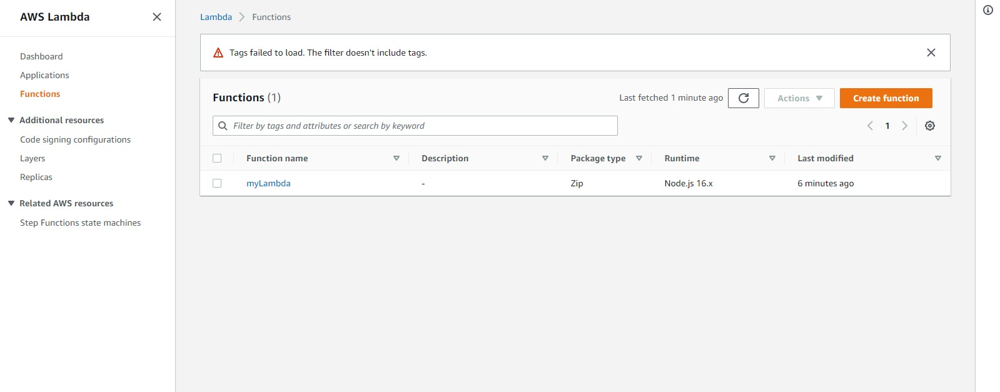
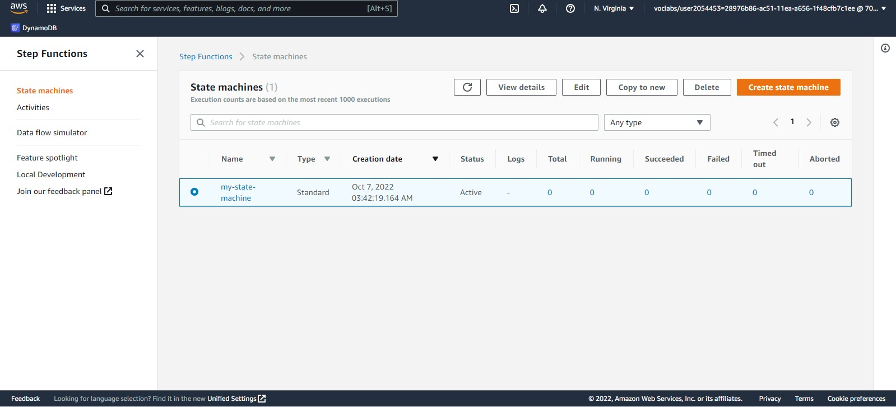
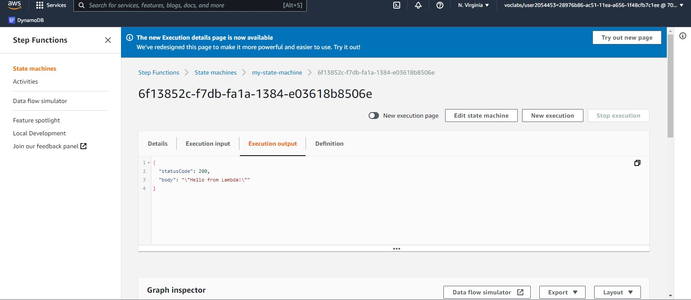

## Create a terraform template to provision a Lambda Function and a Step Function. Attach the lambda function to the step function 

```

provider "aws" {
  region = "us-east-1"
  access_key = var.access_key
  secret_key = var.access_secret
}

variable "access_key" {
  description = "aws access key"
}

variable "access_secret" {
  description = "aws secret key"
}


data "archive_file" "zip" {
  type        = "zip"
  source_file = "index.js"
  output_path = "index.zip"
}

#Create  IAM role for Lambda
resource "aws_iam_role" "iam_for_lambda" {
  name = "iam_for_lambda"

  assume_role_policy = <<EOF
{
  "Version": "2012-10-17",
  "Statement": [
    {
      "Action": "sts:AssumeRole",
      "Principal": {
        "Service": "lambda.amazonaws.com"
      },
      "Effect": "Allow",
      "Sid": ""
    }
  ]
}
EOF
}

# Create Lambda Function
resource "aws_lambda_function" "lambda" {

  filename      = "index.zip"
  function_name = "myLambda"
  role          = aws_iam_role.iam_for_lambda.arn
  handler       = "index.handler"
  runtime       = "nodejs16.x"
}


# create Step Function
resource "aws_sfn_state_machine" "sfn_state_machine" {
  name     = "my-state-machine"
  role_arn = aws_iam_role.iam_for_sfn.arn

  definition = <<EOF
{
  "Comment": "AWS Lambda Function",
  "StartAt": "Hello",
  "States": {
    "Hello": {
      "Type": "Task",
      "Resource": "${aws_lambda_function.lambda.arn}",
      "End": true
    }
  }
}
EOF

}

# Create IAM role for AWS Step Function
resource "aws_iam_role" "iam_for_sfn" {
  name = "my-sfn-role"

  assume_role_policy = <<EOF
{
  "Version": "2012-10-17",
  "Statement": [
    {
      "Effect": "Allow",
      "Principal": {
        "Service": "states.amazonaws.com"
      },
      "Action": "sts:AssumeRole"
    }
  ]
}
EOF
}

resource "aws_iam_role_policy" "sfn_policy" {
  name    = "my-sfn_policy"
  role    = aws_iam_role.iam_for_sfn.id

  policy  = <<-EOF
  {
    "Version": "2012-10-17",
    "Statement": [
      {
        "Action": [
          "lambda:InvokeFunction"
        ],
        "Effect": "Allow",
        "Resource": "${aws_lambda_function.lambda.arn}"
      }
    ]
  }
  EOF
}


```

## Lambda function 


### Step function




